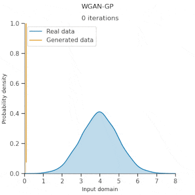
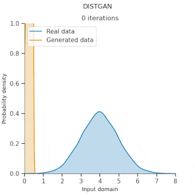
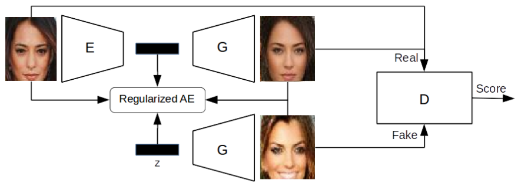
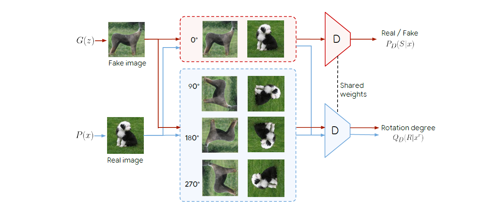
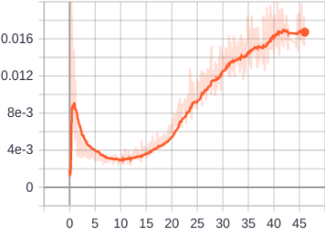
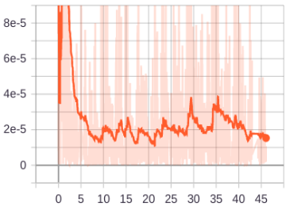
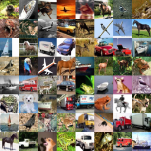
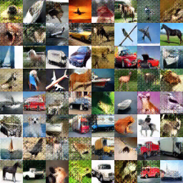
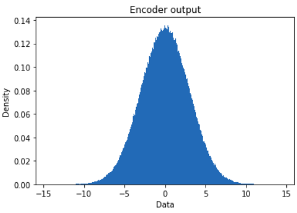

# Self-supervised GAN: Analysis and Improvement with Multi-class Minimax Game
This repository is an attempt to implement the NeurIPS 2019 [paper](https://arxiv.org/abs/1911.06997) on PyTorch backend. In this article, the model establishes state-of-the-art FID scores on CIFAR-10, CIFAR-100, STL-10, CelebA, Imagenet 32 × 32 and Stacked-MNIST datasets, outperforming existing works by considerable margins in some cases. Even though I use the best baseline model Dist-GAN with ResNet architecture, I am unable to reproduce the result an FID of 11.40 on CIFAR10 dataset with this code. I plan to continue the project and deal with the issue, but at the moment I do not have enough GPU resourses.<br>
I did not find another implementation on PyTorch. The official tensorflow implementation is [here](https://github.com/tntrung/msgan).

## Training
### 1D demo with visualization
For visualization requires the ImageMagick library.
```
>> cd distgan_toy1d
>> sh install_imagemagick.sh
>> python train.py
```
### CIFAR-10
```
>> sh exps/mdistgan_cifar10.sh
```
## Related works
### Dist-GAN: An Improved GAN using Distance Constraints | [paper](https://arxiv.org/abs/1803.08887)
The authors propose effective training algorithms for GANs to alleviate mode collapse and gradient vanishing. 
 <br>
In the literature, VAEGAN is most related to this work in term of using AE to improve the generator. However, the design is remarkably different: <br>
- VAEGAN considered the reconstructed samples as “fake”. In contrast, Dist-GAN uses them as “real” samples, which is important to restrain the discriminator in order to avoid gradient vanishing, therefore, reduce mode collapse.<br>
<br>
- The authors propose a latent-data distance regularization loss )-g(E(x)%2C%20z)%5C%7C_2%5E2), where  and  are distance functions computed in data and latent space. The loss strives to reduce mode collapse.

### Self-Supervised GANs via Auxiliary Rotation Loss | [paper](https://arxiv.org/abs/1811.11212)
The paper presents a method to combine adverserial training with self-supervised learning. It uses the concept of Auxilliary Rotation Loss. The main idea behind self-supervision is to train a model on a pretext task like predicting rotation angle and then extracting representations from the resulting networks. The discriminator also tries to predict the rotatory angle(0, 90, 180, 270) along with the normal prediction of fake vs real.


## Change from the original
During training, I noticed that reconstruction and regularization losses are differ markedly:<br>
 <br>
In the original Dist-GAN, reconstruction and regularization losses are added and then used by the Autoencoder optimizer. Instead, I used two optimizers for each loss, respectively.
## Current results
After 100k iterations, the model attains an FID of 26.76 and then does not improve. I found evidence that the error is in regularization loss:
1) Model is trained without recontruction and regularization losses attains an FID of 25.23 after 200k iterations.
2) With reconstruction part, AE has no problems:<br>
 <br>
3) The noise input is uniformly distributed over [−1, 1], while the output of encoder has normal distribution with big variance:
 


## Attribution
- Forked from: [An unofficial Pytorch implementation SNGAN, achieving IS of 8.21 and FID of 14.21 on CIFAR-10.](https://github.com/GongXinyuu/sngan.pytorch)
- Unofficial FID code copied from: [A Port of Fréchet Inception Distance (FID score) to PyTorch](https://github.com/mseitzer/pytorch-fid).
- 1D demo visualization forked from: [Tensorflow code of Dist-GAN, GN-GAN and other GAN methods
](https://github.com/tntrung/gan).